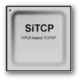

Read this in other languages: [English](README.md), [日本語](README.ja.md)

# SiTCPXG Netlist for Kintex7

SiTCPXG Library (edif file) for Xilinx Kintex7.


## What is SiTCPXG

Simple TCP/IP implemented with support only for 10GbE on an FPGA (Field Programmable Gate Array) for the purpose of transferring large amounts of data in physics experiments.

* For details, please refer to [SiTCP Library page](https://www.bbtech.co.jp/en/products/sitcp-library/).
* For other related projects, please refer to [here](https://github.com/BeeBeansTechnologies).




## History

#### 2024-04-25 Ver.4.0
* Fixed a problem in which the sending module would stall if an ARP response and RBCP response occurred at the same time.

#### 2023-01-04 Ver.3.0
* Fixed the problem that the IP data length becomes abnormal when ACK reply and data transmission overlap.
* Improved ACK response to include data in response packets if data is available, even if it does not reach the watermark.
* Improved to disable Nagle timer on session disconnect.

#### 2021-12-02 Ver.2.0

* Reduced minimum IFG for reception from 12Byte to 4Byte
* Reduced IFG during transmission from 74Byte (1518Byte packet) to 12Byte on average
* Fixed a bug that transmission becomes abnormal after receiving RST
* Removed timeout function before session establishment in client mode
* Improved fast retransmission (reduced unnecessary retransmissions)
* Added timeout at the end of session

#### 2020-11-17 Ver.1.0

* First release.

